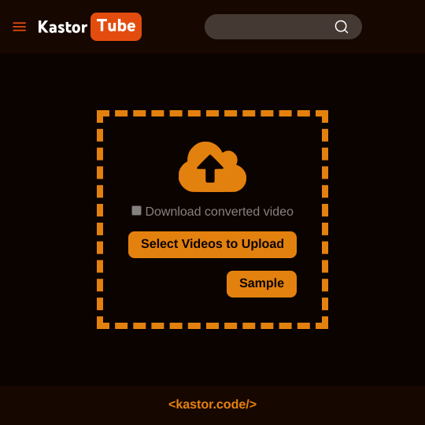
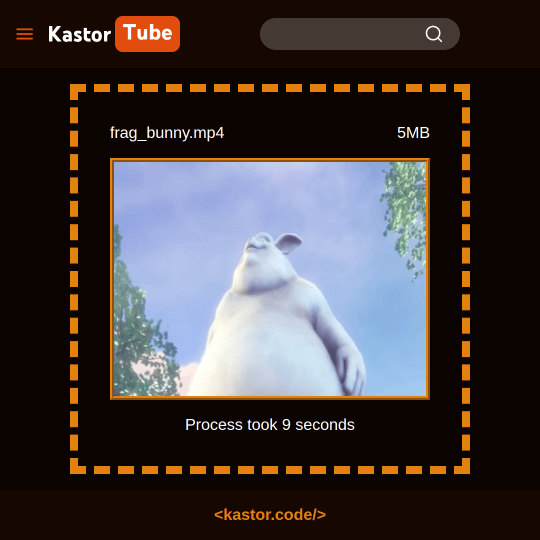

## JavaScript MP4 to WebM with WebCodecs API Sample

> 👷 Developed by Matheus Ramalho de Oliveira  
🔨 Brazilian Software Engineer  
🏡 Goiânia, Goiás, Brasil  
✉️ kastorcode@gmail.com  
👍 [instagram.com/kastorcode](https://instagram.com/kastorcode)

---

  Fullstack project that demonstrates how to pre-process an MP4 video by converting it to WebM and reducing its resolution directly in the browser before uploading to the server. Everything is done on demand using Streams, WebCodecs, Web Workers and Canvas.

---

### Screenshots

  
  

---

### Installation and execution

Backend

1. Make a clone of this repository;
2. Open the backend folder in a terminal;
3. Run `yarn` to install dependencies;
4. Run `yarn start` to start the server at port `3000`.

Frontend

1. Open the frontend folder in a terminal;
2. Run `yarn` to install dependencies;
3. Run `yarn start` to start browser-sync at `https://localhost:3001`.

---

  <big><b>&lt;kastor.code/&gt;</b></big>

